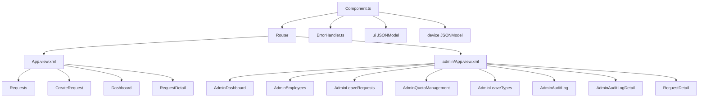

# SAP UI5 Fiori Leave Management Application (zleave)

This repository contains the source code for the **zleave** SAP Fiori application, a modern, role-based Leave Management system built using SAP UI5, TypeScript, and OData V2.

---

## Table of Contents
1. [Project Overview](#1-project-overview)
2. [Project Structure](#2-project-structure)
3. [Application Architecture](#3-application-architecture)
4. [Routing Configuration](#4-routing-configuration)
5. [Role & Authorization](#5-role--authorization)
6. [Functional Modules](#6-functional-modules)
7. [OData Service & Entity Sets](#7-odata-service--entity-sets)
8. [UI Models](#8-ui-models)
9. [Important Services & Utilities](#9-important-services--utilities)
10. [Build & Run Commands](#10-build--run-commands)
11. [Coding Conventions](#11-coding-conventions)
12. [Future Improvements](#12-future-improvements)
13. [Troubleshooting](#13-troubleshooting)
14. [Dependencies](#14-dependencies)
15. [Environment Requirements](#15-environment-requirements)
16. [Deployment](#16-deployment)

---

## 1. Project Overview

* **Project Name**: `zleave`
* **Purpose**: Provides a self-service interface for employees to create and monitor leave requests, while granting managers and HR admins an administration shell to manage employee quotas, approve/reject requests, edit leave types, and review audit logs.
* **Technology Stack**:
  - SAP UI5 (Framework version: `1.108.33` or higher)
  - TypeScript (Language compiler: `^5.9.3`)
  - OData Protocol: Version `2.0`
  - Gateway Client: S/4HANA OData Backend (client: `324`)
  - Build Tooling: UI5 CLI Spec version `4.0`

---

## 2. Project Structure

The codebase is organized as a standard TypeScript-based SAP UI5 project with a transpile step.

```text
webapp/
├── changes/                 # Fiori Flexibility adjustments (unused in base version)
├── controller/              # TypeScript controllers managing application logic
│   ├── admin/               # Controllers for the HR / Admin dashboard and pages
│   │   ├── AdminAuditLog.controller.ts
│   │   ├── AdminAuditLogDetail.controller.ts
│   │   ├── AdminDashboard.controller.ts
│   │   ├── AdminEmployees.controller.ts
│   │   ├── AdminLeaveRequests.controller.ts
│   │   ├── AdminLeaveTypes.controller.ts
│   │   ├── AdminQuotaManagement.controller.ts
│   │   └── App.controller.ts
│   ├── App.controller.ts            # Root/Employee shell controller
│   ├── CreateRequest.controller.ts  # Form request creation controller
│   ├── Dashboard.controller.ts      # Employee main dashboard controller
│   ├── RequestDetail.controller.ts  # Shared request detail view controller
│   ├── Requests.controller.ts       # Employee list view controller
│   └── Unauthorized.controller.ts   # Unauthorized landing page controller
├── css/                     # Styling stylesheet
│   └── style.css            # Custom CSS styles overriding standard UI5 components
├── i18n/                    # Localization files
│   └── i18n.properties      # Default locale property keys and translation values
├── localService/            # Offline metadata & mock server setup
│   └── mainService/
│       ├── data/            # Local JSON mock datasets for testing
│       ├── metadata.xml     # Extracted service metadata schema
│       └── ZUI_LEAVE_MGMT_O2_VAN.xml # Annotation definitions
├── model/                   # Model definition and sidebar definitions
│   ├── models.ts            # Predefined device and model helper methods
│   └── nav.model.ts         # Navigation items setup for the admin sidebar menu
├── service/                 # Services layer
│   ├── ErrorHandler.ts      # Centralized HTTP request and gateway error handler
│   └── LeaveRequestService.ts # Service containing typed Promise wrappers for OData V2
├── test/                    # Integration, OPA5, and Unit QUnit test runners
├── types/                   # Custom type definitions and modules declarations
├── view/                    # XML View templates
│   ├── admin/               # XML views and dialog fragments for admin panel
│   │   ├── EmployeeDialog.fragment.xml
│   │   ├── LeaveRequestDialog.fragment.xml
│   │   ├── LeaveTypeDialog.fragment.xml
│   │   ├── AdminAuditLog.view.xml
│   │   ├── AdminAuditLogDetail.view.xml
│   │   ├── AdminDashboard.view.xml
│   │   ├── AdminEmployees.view.xml
│   │   ├── AdminLeaveRequests.view.xml
│   │   ├── AdminLeaveTypes.view.xml
│   │   ├── AdminQuotaManagement.view.xml
│   │   └── App.view.xml
│   ├── App.view.xml         # Root Shell container view
│   ├── CreateRequest.view.xml
│   ├── Dashboard.view.xml
│   ├── RequestDetail.view.xml
│   ├── Requests.view.xml
│   └── Unauthorized.view.xml
├── Component.ts             # Central App Component initializing models and router
├── index.html               # App launcher entry file (development fallback)
└── manifest.json            # Deployment descriptor configuring routes, targets, and models
```

---

## 3. Application Architecture



### Component Architecture
* **Component.ts**: Initializes global UI State models (`ui` & `device`), starts the `Router`, registers the global `ErrorHandler` against the OData model, and installs a **Route Guard** to intercept navigation events.
* **Router**: Standard asynchronous routing engine (`sap.m.routing.Router`) configured in `manifest.json`.
* **App Shell Layouts**:
  - **Employee Shell (`App.view.xml`)**: Main viewport displaying top level navigation or headers for regular employees.
  - **Admin Shell (`admin/App.view.xml`)**: Nested navigation shell with a `SideNavigation` navigation sidebar list and a main `NavContainer` displaying HR/Admin sections.
* **Shared Controllers/Views**:
  - `RequestDetail.view.xml` and `RequestDetail.controller.ts` are shared dynamically by both route patterns. The layout logic dynamically alters actions and headers depending on whether it was opened via the Employee shell path or the Admin shell path.

---

## 4. Routing Configuration

The application defines the following routes under `sap.ui5 > routing` in `manifest.json`:

| Route Name | Pattern | Target(s) | Role Allowed | Description |
| :--- | :--- | :--- | :--- | :--- |
| **dashboard** | `""` | `dashboard` | Employee, HR, Admin | Main employee landing dashboard |
| **requests** | `"requests"` | `requests` | Employee, HR, Admin | Employee list of submitted requests |
| **EmployeeLeaveRequestDetail** | `"requests/detail/{uuid}"` | `EmployeeLeaveRequestDetail` | Employee, HR, Admin | Employee view of detailed leave request details |
| **createRequest** | `"requests/create"` | `createRequest` | Employee, HR, Admin | Request creation wizard |
| **AdminShell** | `"admin"` | `adminShell`, `AdminDashboard` | HR, Admin | Admin side bar layout and dashboard |
| **AdminDashboard** | `"admin/dashboard"` | `adminShell`, `AdminDashboard` | HR, Admin | Nested Admin analytics dashboard |
| **AdminEmployees** | `"admin/employees"` | `adminShell`, `AdminEmployees` | HR, Admin | Employee listing & registration panel |
| **AdminLeaveRequests** | `"admin/leave-requests"` | `adminShell`, `AdminLeaveRequests` | HR, Admin | Pending request listing and batch actions |
| **QuotaManagement** | `"admin/quota"` | `adminShell`, `QuotaManagement` | HR, Admin | Quota verification and modification panel |
| **AdminLeaveTypes** | `"admin/leave-types"` | `adminShell`, `AdminLeaveTypes` | HR, Admin | Leave types dictionary CRUD view |
| **AdminAuditLog** | `"admin/audit-log"` | `adminShell`, `AdminAuditLog` | HR, Admin | Audit log history trace list |
| **AdminAuditLogDetail** | `"admin/audit-log/{logId}"` | `adminShell`, `AdminAuditLogDetail` | HR, Admin | Detailed trace steps for an audit record |
| **AdminLeaveRequestDetail** | `"admin/requests/detail/{uuid}"`| `adminShell`, `AdminLeaveRequestDetail`| HR, Admin | Admin view of detailed leave request details |
| **Unauthorized** | `"unauthorized"` | `Unauthorized` | All | Access denied landing screen |

---

## 5. Role & Authorization

Role constraints are enforced at the application level via the global component route guard matching current user roles defined in `ROUTE_PERMISSIONS`:

```typescript
const ROUTE_PERMISSIONS = {
    "Dashboard": ["Employee", "Admin", "HR"],
    "Requests": ["Employee", "Admin", "HR"],
    "CreateRequest": ["Employee", "Admin", "HR"],
    "AdminDashboard": ["Admin", "HR"],
    "AdminEmployees": ["Admin", "HR"],
    "QuotaManagement": ["Admin", "HR"],
    "LeaveTypeManagement": ["Admin", "HR"],
    "HolidayManagement": ["Admin", "HR"]  // Permission defined; Route target TODO
};
```

### Role Descriptions & Entitlements
1. **Employee**: Access to Employee shell pages (Dashboard, CreateRequest, Requests list, RequestDetail).
2. **Manager**: Access to Employee shell pages. Can approve or reject employee-submitted requests from their own list view.
3. **HR**: Authorized to view Admin shell. Can see pending requests (with status `MGR_APPROVED`), perform batch approvals/rejections via `hrApproveResult`/`hrRejectResult`, and modify quotas.
4. **Admin**: Superuser access to Admin shell. Can edit leave types, register new employees, modify quotas, view all pending requests (`SUBMITTED` or `MGR_APPROVED`), and inspect the audit logs.

---

## 6. Functional Modules

### Employee Module
* **Dashboard**: Displays a breakdown of remaining leave quotas (Annual, Sick, Unpaid) alongside tables for upcoming leaves and recent notifications.
* **Requests**: Grid showing the status of the logged-in user's leave requests. Managers also see pending approvals here.
* **Create Request**: Input wizard with date ranges, attachments, and dynamic quota impact calculations.
* **Leave Request Detail**: Displays the request status, reason, history logs, and download link for uploaded files.

### Admin Module
* **Dashboard**: Analytics view showing statistics on pending approval queues and a timeline of recent audit logs.
* **Employee Management**: Create/Edit employee listings, assign position titles, manager structures, and activate/deactivate accounts.
* **Leave Type Management**: Manage the dictionary of valid leave types, maximum year limits, approval flags, and activation toggles.
* **Quota Management**: View and modify leave balances (annual leave remaining, sick leave) for individual employees.
* **Audit Log**: Chronological review table of actions performed by system users, including old status and new status changes.
* **Holiday Management**: **[TODO]** This module is placeholder permission only. There are no routes, views, or backend OData entity sets implemented for Holiday Management in this base application.

---

## 7. OData Service & Entity Sets

The application communicates with the backend via the `/sap/opu/odata/sap/ZUI_LEAVE_MGMT_O2/` gateway service.

### Entity Sets
* **Employee**: Standard entity set of system employees. Used to fetch profile configurations and value helps.
* **EmployeeAdmin**: Admin-level employee records containing attributes such as `IsAdmin`, `IsHR`, `IsManager`, and status activation flag.
* **LeaveRequest**: Leave requests submitted by employees. Enables attachments support.
* **LeaveRequestAdmin**: Overarching leave request data accessible to HR Admins for reviewing approvals.
* **LeaveQuota**: Individual quota overview balances.
* **LeaveType / LeaveTypeAdmin**: System leave type configuration.
* **AuditLog**: Table of historical audits.
* **QuotaOverview**: Aggregated view of leave quotas.
* **ZI_MANAGER_VH**: Read-only value help listing eligible managers.

### OData Function Imports
* **`/approveResult`**: Approve a leave request as a Manager.
* **`/rejectResult`**: Reject a leave request as a Manager.
* **`/hrApproveResult`**: Approve a leave request as an HR Admin.
* **`/hrRejectResult`**: Reject a leave request as an HR Admin.
* **`/activate`**: Activate an employee profile.
* **`/deactivate`**: Deactivate an employee profile.

---

## 8. UI Models

Three main models are mounted globally:

1. **Default Model (`""`)**:
   - Class: `sap.ui.model.odata.v2.ODataModel`
   - Purpose: Main backend gateway connection declared in `manifest.json`. Syncs tables, detail fields, and executes function imports.
2. **`ui` Model**:
   - Class: `sap.ui.model.json.JSONModel`
   - Purpose: Handles dynamic state variables like sidebar selection keys, active tab indicators, and caches the current user profile.
3. **`device` Model**:
   - Class: `sap.ui.model.json.JSONModel`
   - Purpose: Exposes responsive layouts indicators (`/device/system/phone`, `/device/system/desktop`, etc.).

---

## 9. Important Services & Utilities

### ErrorHandler (`service/ErrorHandler.ts`)
A centralized service class that hooks into `ODataModel` metadata and request failure events.
* Installs a listener for HTTP request failures.
* If a `403 Forbidden` response is detected, it flags the Component as unauthorized and redirects to the `Unauthorized` view.
* Displays dialog notifications for connection issues or gateway error responses.

### Formatter / Local Formatting
Utility formatting methods are located in individual controllers (e.g. `AdminAuditLogDetail.controller.ts`, `Requests.controller.ts`) to adjust status colours, format date intervals, and map employee names.

---

## 10. Build & Run Commands

Run these scripts from the project directory containing `package.json`:

```bash
# Install dependencies
npm install

# Start local dev server with real backend proxy (flp layout)
npm start

# Start local dev server with local mock server data
npm run start-mock

# Run TypeScript compilation checks
npm run ts-typecheck

# Run ESLint validation
npm run lint

# Build the production bundle into /dist directory
npm run build

# Deploy application to SAP NetWeaver Gateway server
npm run deploy

# Undeploy application from the SAP NetWeaver Gateway server
npm run undeploy
```

---

## 11. Coding Conventions

* **Structure**: Maintain segregation between Employee shell pages (at the root of `view/` and `controller/`) and Admin pages (nested in `view/admin/` and `controller/admin/`).
* **Naming**:
  - File Names: PascalCase (e.g., `Requests.controller.ts`, `AdminDashboard.view.xml`).
  - Namespace Prefix: `zleave.zleave` for components.
* **TypeScript Rules**:
  - Strictly typed. Declare types for parameters and variables.
  - Return types should be explicitly specified on methods (`: void`, `: Promise<T>`).
  - Cast UI5 models and UI elements to prevent typescript errors (e.g., `(this.getView().byId("btnApproveSelected") as Button)`).
* **UI5 Best Practices**:
  - Never store hardcoded mock data structures inside the controllers. Always utilize standard binding or OData calls.
  - Use asynchronous API calls and wrap XML bindings in `ui` model tracking properties where appropriate.

---

## 12. Future Improvements
* **[TODO] Holiday Management View**: Add a visual calendar or holiday list view matching the route permissions defined on the Component.
* **Notification Badges**: Add real-time pending request badges to the admin sidebar navigation menu.
* **Employee Directory**: Implement a public directory view page allowing employees to review peer leave calendars.

---

## 13. Troubleshooting

### 1. Metadata Failed to Load
* **Symptoms**: The application freezes on startup, showing a "Metadata failed" dialog.
* **Fix**: Ensure you have a working connection to the SAP backend proxy `https://s40lp1.ucc.cit.tum.de`. If running offline, launch the application using `npm run start-mock` instead.

### 2. 403 Forbidden Redirection
* **Symptoms**: The application automatically redirects to `/unauthorized`.
* **Fix**: Check that your SAP username has the appropriate configurations in the `/Employee` entity set and is assigned the correct administrative authorization rules.

### 3. Route Targets Failing to Resolve
* **Symptoms**: A blank screen appears when accessing nested links.
* **Fix**: Ensure that the route target array in `manifest.json` specifies the parent container (e.g., `["adminShell", "AdminDashboard"]`) so nested aggregation views load correctly.

---

## 14. Dependencies

Declared in `package.json`:
* **DevDependencies**:
  - `@sapui5/ts-types`: Types declarations library for SAP UI5 APIs.
  - `@ui5/cli`: Command line utility for building and serving UI5 apps.
  - `typescript`: Transpiler compiler.
  - `ui5-tooling-transpile`: UI5 middleware and task for transpiling TypeScript.

---

## 15. Environment Requirements

* **Node.js Version**: `^18.0.0` or `^20.0.0` (LTS versions recommended).
* **npm Version**: `^9.0.0` or `^10.0.0`.
* **UI5 CLI Version**: `^4.0.0` (locally packaged version).
* **TypeScript Version**: `^5.0.0`.

---

## 16. Deployment

The application is deployed directly to the SAP ABAP Repository (SAP NetWeaver Gateway server) using the SAP Fiori tools deployment command.

### Deployment Configuration (`ui5-deploy.yaml`)
- **Plugin Task**: `deploy-to-abap` (provided by `@sap/ux-ui5-tooling`)
- **Target Gateway URL**: `https://s40lp1.ucc.cit.tum.de`
- **Target SAP Client**: `324`
- **BSP Application Name**: `ZLEAVE_APP`
- **ABAP Package**: `$TMP` (temporary package; local object, meaning no transport request is required)

### How to Deploy
Run the following npm command from the `zleave` directory:
```bash
npm run deploy
```
This script executes `npm run build` to compile the TypeScript files and bundle assets into the `dist` directory, then invokes `fiori deploy --config ui5-deploy.yaml` to upload the package to the SAP Gateway server.
